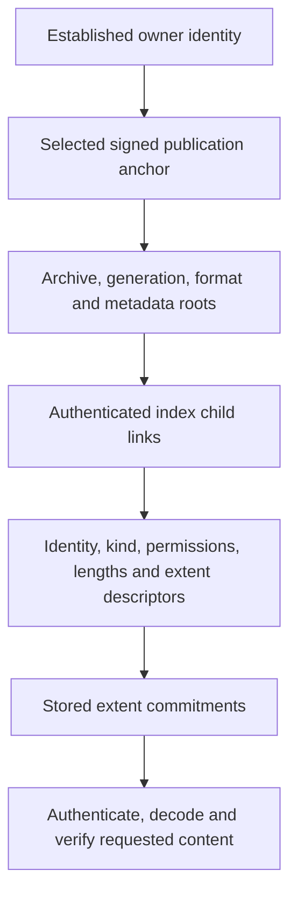

# 001: Owner authorization and independent recovery

Status: proposed, 2026-09-26. Author: Codex. Product/security reviewer: unassigned.
Bounded proof, mirrored-publication and authenticated keyed-index experiments
implemented, including packed ordered pages and bulk construction; final layout
selection and archive integration remain outstanding.
No wire change activated. Goals G5/G6/G7; acceptance A2/A3/A7.

## Problem

Native salvage currently opens a reconstructed snapshot, then checks that a
recovered entry equals an entry in its verified TOC. Signed plaintext open hashes
all live contents. One damaged object therefore prevents proving an intact
neighbour. Truncating tail control data can remove the selected publication proof.
An unauthenticated recovery manifest cannot safely bypass either dependency.

## Recommendation

Separate owner-authorized **membership** from independent **content verification**.
Evaluate a signed commit commitment over canonical metadata and per-object content
commitments. Include archive identity, sequence, logical identity, lengths,
permissions, frame order, codec/protection descriptors and relevant non-file
records. Recovery should verify the selected commit and one object's proof without
opening unrelated content. Bind descriptors and payload to the same owner proof
in encrypted signed mode, including against a content-key holder.

Keep eager normal-open verification for now. This avoids silently changing when
existing callers learn about damage. Use the same commitments to verify all objects
at open and to verify one object during salvage. A later lazy-open API requires a
separate decision with explicit semantics, not a benchmark-only toggle.

Compare a flat authenticated object table against a tree with per-object proofs.
The former is simpler but loses authority if the table is damaged; the latter can
improve proof survival but adds update/storage complexity. Measure both metadata
rewrite and recovery costs before selecting an encoding.

## Alternatives and limits

* Keep whole-snapshot verification: lowest protocol change, but fails independent
  recovery and retains payload-proportional signed-open cost.
* Trust scanned descriptors/checksums: rejected; cannot establish owner authority,
  publication or deletion freshness.
* Sign each content object alone: insufficient without committed membership;
  signatures on deleted/abandoned content remain mathematically valid.
* Signed membership plus recoverable proof redundancy: recommended experiment.
  Specify which independent damage regions it tolerates. A lost final auth record
  requires a durable redundant publication proof, not merely more payload hashes.

If all publication proofs are lost, fail closed with an explicit report. A previous
valid generation may be offered as historical salvage only when clearly labeled;
it must not silently resurrect deletions as the current state. Full-file rollback
cannot be detected without external freshness state.

## Required evidence

A concrete byte/proof graph, publication ordering and tear analysis; adversarial
substitution tests in all modes; neighbour/TOC/tail damage matrix; eager-open and
small-update costs; conformance vectors; storage/security review. Existing native
failures stay visible until the selected contract explains and tests their expected
outcomes. Do not merely change expected recovered-file counts to obtain green tests.

## Executed proof experiment

The [bounded experiment and evidence](../evidence/recovery-commitments-2026-09-26/README.md)
compares a flat object commitment with binary Merkle proofs. Real default/native
archive extents and hybrid signatures establish the intended separation: a damaged
neighbour need not invalidate the survivor's owner-authorized descriptor and data.
A valid signature from an untrusted owner or on an unpublished root is rejected.

The experiment uses canonical TOC descriptors and hashes of complete stored extents.
Encrypted data therefore commits to ciphertext, rather than exposing a public
plaintext digest of a low-entropy secret. Private identity/descriptor/proof records
must retain their confidentiality policy in a persisted design. A public root does
not justify making private commitment tables public.

At 100,000 synthetic descriptors the tree retains about 8 MiB of hashes and an
inclusion proof occupies 568 bytes. Initial construction costs 1.778× a flat-table
hash; local verification and same-identity replacement avoid hashing the whole
table. These component measurements exclude payload I/O, signatures and publication.

The next integration should authenticate child links in a keyed index, preferably
sharing the logical record index rather than introducing a duplicate catalogue.
The fixed-ordinal binary experiment is unsuitable as the final mutation index:
insertions/removals can shift many leaves. Measure those operations before selection.

## Proof graph and publication boundary

The selected anchor is an independent precondition. A membership root signed during
preparation does not prove that it was published. Searching for the largest valid
signature can resurrect an abandoned prepared snapshot. A header MAC known to a
read-only content-key holder cannot itself establish owner publication authority.
The original proof test supplied that digest from its fixture. The new
[publication layer](../evidence/publication-anchors-2026-09-27/README.md) persists and
authenticates it through mirrored records, and its fault/process-death checks pass.
The normal archive reader/writer still does not activate this encoding.

Candidate persistence protocol (steps 1–4 implemented and tested; complete keyed
index, allocator and archive integration remain outstanding):

1. Reserve two independently validated publication-record slots outside append-only
   tail control data. Size them for the bounded hybrid signature/key records; the
   current two 192-byte header slots cannot directly hold those records. Bind a
   distinct publication domain, archive ID, generation, format, owner identity,
   committed roots, sealed bounds and previous-publication commitment. Object counts
   remain in private index metadata; do not expose them in the public anchor.
2. Persist prepared payload, authenticated index nodes and allocation/cleanup
   descriptors, then synchronize them before writing a publication record.
3. Write and synchronize one new publication record, then mirror the same signed
   publication into the other slot and synchronize it. The first valid publication
   is the commit transition; mirror completion is required before acknowledging
   success or erasing allocations required by the old publication.
4. Resume an interrupted mirror before cleanup. Two valid unequal generations
   select the newer publication after its dependencies validate; equal generations
   with conflicting roots are an error. A torn new slot leaves the prior generation
   recoverable. Completed mirrored publication tolerates loss of either slot.
5. Traverse authenticated child links to recover requested entries independently.
   Metadata-node redundancy must cover the promised damage model; putting a root
   at the front alone cannot recover a destroyed membership path. Compare mirrored
   index nodes against other bounded redundancy before freezing placement.
6. Report lost/ambiguous authority when both selected publication proofs or required
   membership paths are unavailable. A historical root is explicitly historical.
   Replaying an entire older authentic archive remains outside offline freshness
   guarantees and requires external state to detect.

This changes the publication region and index encoding and belongs to the unreleased
format-4/`0.5.x` design. It cannot be backported as a compatible format-3/`0.4.x`
change. Retained owner identity, migration, duplicate control-space accounting,
mirrored-node erasure, all record families, and process-death tests are required
before activating it. The two existing native recovery failures remain unresolved
until the integrated protocol passes their damage cases without weakening authority.

## Publication implementation checkpoint — 2026-09-27

The candidate uses two fixed 8 KiB slots, bounded root references, pinned owner
verification for signed modes, a full HMAC-SHA-256 for encrypted unsigned mode and
checksums for plaintext unsigned mode. Thirteen protocol checks pass, including
operation failures, failed-final-sync handling, exhaustive checksum-mode torn-write
prefixes, real process death, wrong-owner/downgrade cases and independent byte vectors.
The stored anchor is now connected to the real-page proof test in both layouts.
[Evidence, candidate byte layout and remaining limits](../evidence/publication-anchors-2026-09-27/README.md).

A readable pair is not a durability result. Only synchronized publication/repair
returns the token the allocator will need before old-state erasure. Tail damage
retains the selected generation's authority separately from whether its data is
available; it must not silently select a previous membership set. I/O failures
remain errors rather than evidence permitting fallback.

The writer must never persist/export publication-domain signatures during preparation.
Fixed slots do not make a replayed authentic publication fresh. The caller supplies
the established owner/archive/mode; integrating that trust with Vault and standalone
API use remains part of the complete format implementation.

## Authenticated-index checkpoint — 2026-09-27

The [persisted keyed-index experiment](../evidence/authenticated-index-2026-09-27/README.md)
now connects publication to canonical descriptors and stored-content commitments,
including the real-page recovery test in both archive layouts. Child links, private
metadata encryption, bounded traversal and copy-on-write insertion/removal are
implemented. Nine focused tests pass; CPU/RSS and write-growth observations cover
100,000 file-backed entries in plaintext and encrypted unpadded modes.

Do not adopt its one-record-per-leaf physical layout. Incremental construction
writes 698–751 MB for 75–81 MB of live nodes; 100,000 entries with constant 64 KiB
padding would occupy 24.41 GiB in live index copies alone. The next comparison must
pack records into index pages and build them in bulk while retaining authenticated
child links, independent lookup, owner publication and metadata confidentiality.
Prefer key ordering that supplies directory/prefix queries without another catalogue.
The allocator must account for both copies and all superseded preparation nodes,
separate mirror failure regions, and gate erasure on synchronized publication.

Then connect allocation/preparation/cleanup and public archive operations. Ordinary
signed-open semantics, complete performance comparisons, migration and release
compatibility remain gates. This is concrete architectural evidence against the
simple physical layout, not permission to weaken padding or resource requirements.

## Packed-index checkpoint — 2026-09-27

[Packed ordered pages and streaming bulk construction](../evidence/packed-index-2026-09-27/README.md)
replace the rejected physical tree inside the candidate. They preserve encrypted
private descriptors, authenticated child links, mirrored publication and path-local
mutation, and add bounded ordered ranges and salvage that reports unavailable
subtrees. Fourteen focused checks pass; real-page recovery passes in both layouts.

Thirty fresh-process observations per protection/padding case show 100k-entry
construction occupying about 21.4–21.6 MB, with no retired construction pages,
median CPU 48–61 ms and largest observed process peak RSS 4,584 KiB. Default padding
now costs 20.625 MiB of live nodes instead of the rejected layout's 24.41 GiB.
This measures sorted descriptor construction, not sorting, payloads or publication.

The trade-off is larger individual mutations: two mirrored 64 KiB padded pages
mean 256 KiB appended for a one-record replacement. Coalescing page edits within
one transaction and allocator reuse/cleanup remain necessary. Do not treat the
component result as a selected whole-archive architecture or a passed A4 gate.
Next persist preparation/cleanup ownership, separate mirror failure regions and
integrate archive operations and data extents before the complete comparison.
