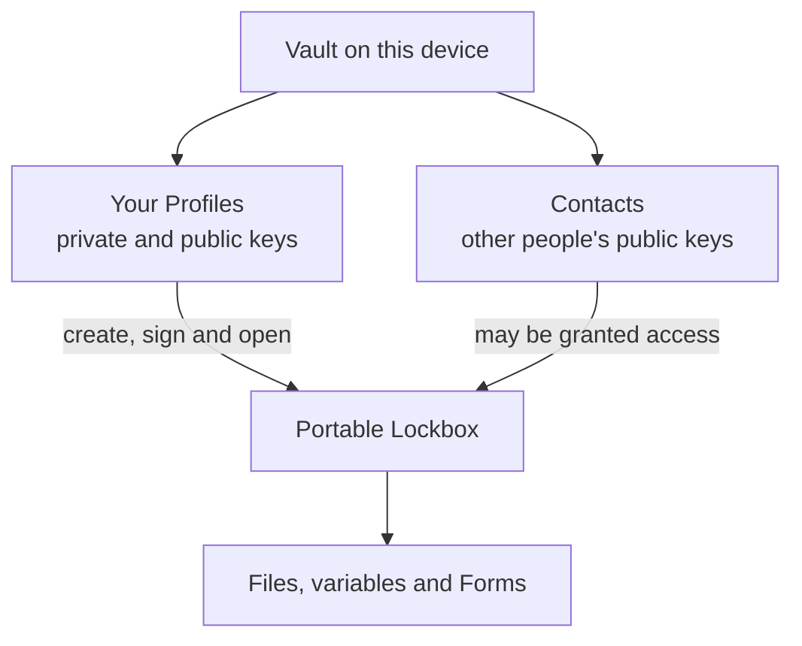

# reVault

reVault is a modern archive format. A reVault archive is called a **Lockbox**. Each Lockbox is compressed, encrypted and signed.

The core engine is written in Rust and is designed to be fast, recoverable and economical with memory. You can use it through the [CLI](cli-tooling/) or from one of the supported [language bindings](apis/revault-api.md).

If you just want to take reVault for a quick spin, jump straight to the [quick start guide](cli-tooling/quick-start-guide.md).

The source repository is available on [GitHub](https://github.com/onepub-dev/reVault).


reVault is currently pre-release software. Keep independent copies of important data and tested Vault/Profile recovery material. See [Versions and compatibility](compatibility.md) for the manual's component scope.


## What can a Lockbox store?

A Lockbox can store:

* files and complete directory trees
* file permissions and symbolic links
* variables arranged in paths such as `/production/API_KEY`
* typed form records such as website logins

Unlike a classic ZIP file, a Lockbox is designed for encryption, signing, sharing and recovery from partial corruption. It also supports random access, so an application can read or update an individual entry without unpacking the whole archive.

reVault supports Linux, macOS and Windows on x64 and ARM. The portable Rust engine also supports WebAssembly.

## The main concepts

reVault uses a Vault, Profiles, Contacts and Lockboxes. The names are similar, so it is worth getting them straight before we go any further.



### Vault

Your **Vault** is the encrypted local store that reVault uses for Profiles, private keys, Contacts, reusable forms and remembered Lockbox credentials.

You will normally have one Vault on each device. Back it up and keep the Vault passphrase safe: losing both the Vault and its backup may leave you unable to open Lockboxes whose credentials exist nowhere else.

Read [The Vault](cli-tooling/the-vault.md) before relying on it for important data.

### Profiles

A **Profile** is one of your identities inside the Vault. It owns the private key material that lets you sign Lockboxes and open Lockboxes created for that Profile.

The default Profile is enough for many people. Extra Profiles are useful when you want to separate work, personal and automated environments.

### Contacts

A **Contact** is another person's public key saved in your Vault. A Contact can be granted access to a Lockbox, but cannot be used to encrypt or sign a lockbox.

Always verify a Contact's fingerprint through a second, trusted channel before sharing sensitive data.

### Lockboxes

A **Lockbox** is the portable `.lbox` archive. You can create as many Lockboxes as you need and give each one to a different group of Contacts or Profiles.

Closing a Lockbox releases the current process's access and asks the Session Agent to forget its cached content key. It does not delete the Lockbox or any persistent credential stored in your Vault.

### Variables

A variable is a name/value pair stored inside a Lockbox:

```
/production/API_KEY: XXXXXXX
/staging/API_KEY: YYYYYYY
```

Variables may be normal or secret. Use a secret variable for passwords, API tokens and other values that deserve extra care in memory.

### Forms

Forms group related values. A website-login form might contain a URL, username and password. A form definition describes the fields and their types; a form record contains the values for one website or account.

Supported field types include `text`, `secret`, `password`, `url`, `email`, `date`, `month`, `notes` and `number`.

## Session Agent and Auto Open

The **Session Agent** is an optional per-user process that temporarily caches a Lockbox content key. This avoids repeatedly deriving or loading the same key during a short working session. The Agent does not retain an open file handle and does not permanently store the content key.

**Auto Open** is separate. Where the operating system provides a suitable credential store, reVault can store the Vault passphrase for unattended access during your logged-in desktop session. That is convenient, but it means a process running as you may be able to open every Lockbox for which the Vault contains a credential.


Closing an Agent session clears a temporary content key from memory. It is not an authentication boundary while Auto Open can still retrieve the Vault passphrase. Lock your desktop whenever you walk away from it.


See [Session Management](cli-tooling/session-management.md) for the available Auto Open scopes and [the Session Agent](cli-tooling/revault-session-agent.md) for its lifetime and sleep behaviour.

## Getting started

Install the CLI with Cargo:

```bash
cargo install revault_cli
```

The package installs two equivalent commands:

* `lockbox` — the full command name
* `lbx` — the short alias used throughout this manual

Initialise your Vault and create a backup:

```bash
lbx vault init
lbx vault backup ./vault-backup.lockbox-backup
```

Create your first Lockbox:

```bash
lbx secrets.lbox create
lbx secrets.lbox add ./readme.md --to docs/readme.md
lbx secrets.lbox list --recursive
```

The [quick start guide](cli-tooling/quick-start-guide.md) continues from here with opening, closing, extracting, variables, forms and sharing.

## Keeping secrets secret

Lockbox protects data while it is inside the encrypted archive. It cannot protect a secret after you print it to a terminal, copy it to the clipboard, write it to an ordinary file, expose it in shell history or send it to another tool.

As a safe starting point:

* use secret variables and secret form fields for credentials and tokens
* use `--interactive`, `--stdin`, `--file` or `--from-env` instead of a command-line value
* keep Vault and Profile backups offline and permission-restricted
* prefer Contact keys over shared Lockbox passwords
* disable Auto Open in environments where unattended same-user access is unacceptable
* run `lbx secrets.lbox close` when you finish working with a Lockbox

Read [Keeping secrets a secret](keeping-secrets-a-secret.md) for the complete checklist.

## Where next?

* [Quick start guide](cli-tooling/quick-start-guide.md)
* [CLI tooling](cli-tooling/)
* [Language APIs](apis/revault-api.md)
* [Sharing](cli-tooling/sharing.md)
* [Mirror projects](mirror.md)
* [CI/CD](ci-cd.md)
* [Migrating between versions](cli-tooling/migrating-between-versions.md)
* [Glossary](glossary.md)
* [Troubleshooting](troubleshooting.md)

## License

reVault is distributed under the Dvault Source Available License 1.0. Read the [complete licence](https://github.com/onepub-dev/reVault/blob/master/LICENSE) before redistributing reVault, publishing a derivative work or offering related functionality as a service.
