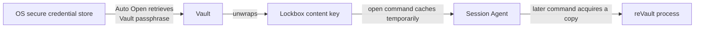

# Session management

reVault uses two related features to avoid asking for your Vault passphrase on every command:

* the **Session Agent** keeps the content keys for open Lockboxes in memory for a limited time;
* **Auto Open** stores your Vault passphrase in your operating system's secure credential store.

They are deliberately separate. You can use the Session Agent without enabling Auto Open.



Disabling Auto Open removes the first unattended path. Closing a Lockbox removes its cached key from the agent; it does not remove credentials from the Vault or operating-system store.

## See what is open

```bash
lbx session
```

Open a Lockbox for one hour:

```bash
lbx secrets.lbox open --duration 1h
```

Every successful use refreshes the Lockbox's expiry time. Close one Lockbox, all Lockboxes, or the agent itself with:

```bash
lbx secrets.lbox close
lbx session close-all
lbx session stop
```

`stop` clears the in-memory sessions and stops the Session Agent. A later command starts it again when required.

## The default Lockbox

If you use one Lockbox regularly, make it the default:

```bash
lbx session default secrets.lbox
lbx list
```

Clear the default with:

```bash
lbx session default --clear
```

## Auto Open

Check whether Auto Open is enabled:

```bash
lbx session auto-open status
```

There are two scopes:

```bash
lbx session auto-open vault
lbx session auto-open lockboxes
```

`vault` allows reVault to open the Vault automatically but still requires you to open each Lockbox explicitly. `lockboxes` also allows reVault to open Lockboxes as commands need them.

Disable Auto Open and close all current Lockbox sessions with:

```bash
lbx session auto-open disable
```

The command removes reVault's stored credential from the operating system's secure store.


With Auto Open enabled, anyone or anything operating as you in your unlocked desktop session may be able to open your Vault or Lockboxes. Lock your desktop whenever you walk away.


Closing a Lockbox removes its cached content key from the Session Agent. It is not an authentication boundary when Auto Open can immediately obtain the Vault passphrase and open the Lockbox again.

## Platform secure stores

reVault uses the secure credential service supplied by the operating system:

| Platform | Secure store |
| --- | --- |
| Windows | Credential Manager |
| Linux | Secret Service, commonly provided by libsecret-compatible desktop keyrings |
| macOS | Keychain |

Run `lbx doctor` to check the capabilities available on your machine.
