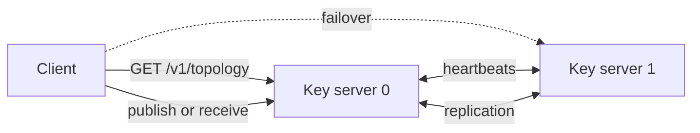

# Topology and failover

A reVault key-server cluster has no separate master topology process. Every `revault_key_server` member can publish the current topology, accept authenticated heartbeats, and replicate publish state.



## Members and routes

Each member has a stable `server_id`, a public `/v1/publish` URL and a status:

* `active` — accepts work for owners routed to it;
* `standby` — available as a failover but does not serve another owner without promotion;
* `promoted` — actively serving a failed owner's work; or
* `disabled` — excluded from service.

A route maps an owner id to its primary and ordered failovers:

```toml
[[route]]
owner = 0
primary = 0
failover = [1]
```

When routes are omitted, reVault builds ring routes from the configured members. Explicit routes are preferable in production because the intended authority is reviewable.

## Heartbeats

Members sharing `cluster_id` and `topology_token` register with one another. The default heartbeat interval is 30 seconds. A member not seen for 90 seconds is filtered from the advertised topology.

The shared topology token authenticates peer registration. It is not published to clients and must not appear in a URL or repository.

Heartbeat filtering changes which servers are considered healthy; it does not silently authorise a standby to serve another owner's retained payloads.

## Replication and promotion

`replication_peer_url` copies live publish state to a peer's `/v1/replicate` endpoint. Replication is authenticated separately with `replication_token`.

If owner `0` fails, an operator may authorise server `1` to serve that owner's replicated state:

```toml
server_id = 1
promoted_owner = 0
```

Restart with the reviewed configuration and update the advertised status/routes as required. When the original owner returns:

1. resynchronise it from the healthy member;
2. verify that it has caught up;
3. restore the intended routes; and
4. remove the temporary promotion.

Do not allow two unsynchronised servers to serve the same owner id.

## Two-member checklist

Both members need the same:

* `cluster_id`
* member list and routes
* `topology_token`
* `replication_token`

Each member needs its own:

* `server_id`
* `public_url`
* `state_dir`
* peer `replication_peer_url`

Expose every endpoint through HTTPS, protect tokens in the root-readable configuration, monitor `doctor` and service logs, and practise promotion and resynchronisation before relying on the cluster.
